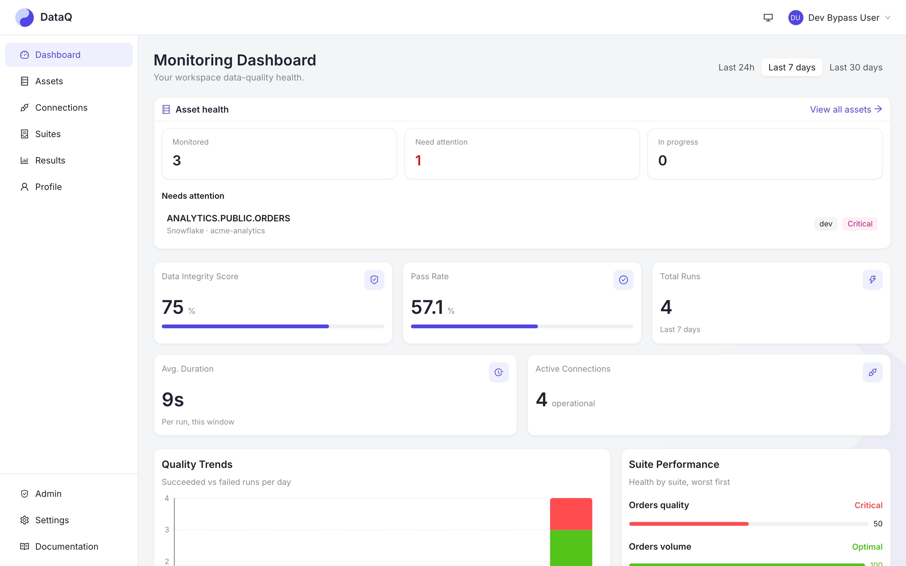

# DataQ

> Data quality monitoring built on Great Expectations — checks your tables and files, alerts the team that owns them, and reacts to the pipelines that load them.

- **📖 Docs:** <https://theurgicduke771.github.io/DataQ/docs/latest/>
- **Status:** `v1.2.0` released 2026-10-04 — [changelog](CHANGELOG.md) · [tracker](docs/progress.md)
- **License:** MIT



## What it does

- **Checks**
  GX expectations (including **custom SQL**), **freshness / volume / schema-drift / anomaly** monitors and cross-dataset **comparison**.
  A column profiler and dry-run work on every datasource.
  Snowflake checks can also run as native DMFs, and Unity Catalog checks as Databricks DQX.
  [Feature matrix →](https://theurgicduke771.github.io/DataQ/docs/latest/reference/feature-matrix/)

- **Assets, lineage & incidents**
  Each table or file rolls up its health across suites, with table- and column-level lineage (dbt, OpenLineage, warehouse-native) and its open incidents.
  [Concepts →](https://theurgicduke771.github.io/DataQ/docs/latest/get-started/concepts/)

- **Quality by dimension**
  Every check is classified (completeness, validity, timeliness, …), so the scorecard shows what *isn't* watched, not just what passes.

- **Automated coverage**
  System-owned suites over the asset inventory, plus a review queue of suggested rules.

- **Run anywhere**
  Run now, on a cron schedule (DST-aware), or from a **pipeline trigger** in ADF, Airflow or dbt.
  A pipeline stage can also ask DataQ for a pass/fail verdict through the **pipeline gate**.
  [Orchestration →](https://theurgicduke771.github.io/DataQ/docs/latest/guides/orchestration/)

- **Alerting**
  Warn / fail / critical tiers → Teams, Slack, email or a webhook, with dedup, snooze and plain-language failure summaries.
  [Notifications →](https://theurgicduke771.github.io/DataQ/docs/latest/guides/notifications/)

- **Suites as code**
  YAML suite files with `validate`, drift and `apply`, through a Python client and the `dataq` CLI.
  [Python client →](https://theurgicduke771.github.io/DataQ/docs/latest/guides/python-client/)

- **Governance**
  Workspace roles plus per-suite sharing (RBAC), PII-redacted failing samples and an audit log.

- **Optional LLM assist** (off by default)
  SQL generation, check suggestions and root-cause narratives.
  [AI features →](https://theurgicduke771.github.io/DataQ/docs/latest/guides/ai-features/)

## Datasources

| Kind | Supported |
|---|---|
| Warehouses / lakehouses | Snowflake (incl. native DMF checks) · Databricks Unity Catalog (incl. DQX) · Apache Iceberg (native read) |
| SQL databases | PostgreSQL · MySQL / MariaDB · Trino · SQL Server — Azure SQL, Synapse, Fabric SQL · Amazon Athena · Amazon Redshift ([driver notes](https://theurgicduke771.github.io/DataQ/docs/latest/guides/datasources-checks/)) |
| Files (CSV / Parquet / JSON, batch patterns) | ADLS Gen2 · Fabric OneLake · AWS S3 and any S3-compatible store (MinIO, R2, Ceph, …) |
| Orchestration (monitor + trigger, not checked) | Azure Data Factory · Apache Airflow · dbt |

## Quick start

### Run it for a team

Deploy on **Azure Container Apps** (primary) or **AWS ECS Fargate** with the reference OpenTofu stacks — the recommended path for production and enterprise teams.
See [Production deployment](https://theurgicduke771.github.io/DataQ/docs/latest/operate/deployment/).

### Evaluate in ~5 minutes

Docker only — no cloud account or identity provider needed:

```bash
curl -O https://raw.githubusercontent.com/TheurgicDuke771/DataQ/main/docker-compose.ghcr.yml
export OPENBAO_TOKEN=$(openssl rand -hex 16)   # root token for the bundled vault
export DATAQ_SIGNIN_EMAIL=you@example.com      # the address allowed to sign in
docker compose -f docker-compose.ghcr.yml up
```

Then:

1. Open **<https://localhost:3000>** and accept the warning for the stack's locally generated certificate.
2. Enter your sign-in address.
3. Read the 6-digit code at **<http://localhost:8025>** (bundled Mailpit — nothing leaves your machine).

Good to know:

- The stack starts migrated, with demo data.
- The UI is the only published surface, as in production; the API is at `https://localhost:3000/api`.
- Images are multi-arch (amd64/arm64) and bind to `127.0.0.1`.
- The database and the bundled OpenBao vault keep their data in `./dataq-data` (set `DATAQ_DATA_DIR` to move it), so connections and their credentials survive a restart.
- To pin a release, set `DATAQ_BACKEND_TAG=vX.Y.Z DATAQ_FRONTEND_TAG=vX.Y.Z` and use the compose file from that same tag.

**SSO:** run the same frontend image with `DATAQ_AUTH_MODE=oidc` plus `DATAQ_AUTH_AUTHORITY`, `DATAQ_AUTH_CLIENT_ID` and `DATAQ_AUTH_API_SCOPE`.
Any standards-compliant OIDC provider works (Azure AD and AWS Cognito are validated).
See [Getting started](https://theurgicduke771.github.io/DataQ/docs/latest/get-started/install/).

### Develop from source

```bash
git clone https://github.com/TheurgicDuke771/DataQ.git && cd DataQ
./scripts/setup.sh    # conda env, pre-commit, images, migrations, seed data
conda activate dataq
docker-compose up     # backend :8000 · frontend :3000 · mail :8025
```

## AI assistants (MCP)

DataQ serves **54 curated MCP tools** at `https://<your-dataq-host>/mcp/`:

- 30 read-only
- 18 that change state
- 6 that open a live datasource connection (gated like writes)

To connect:

- Keep the **trailing slash** on `/mcp/`.
- Send `Authorization: Bearer <token>` — your OIDC token under SSO, or a DataQ API key (`dq_live_…`) under email sign-in.

No connection credential ever passes through the MCP surface.
Client setup for Claude, VS Code / Copilot and Cursor: [MCP setup →](https://theurgicduke771.github.io/DataQ/docs/latest/guides/mcp-setup/)

## Stack & deployment

- **Backend:** FastAPI · Celery · Redis · PostgreSQL + Alembic · Great Expectations
- **Frontend:** React · Vite · Ant Design
- **Secrets:** Azure Key Vault, AWS Secrets Manager or OpenBao
- **Reference deployments:** Azure Container Apps and AWS ECS Fargate (IaC in [`deploy/terraform/`](deploy/terraform/)), behind provider-neutral seams — see [deployment parity](https://theurgicduke771.github.io/DataQ/docs/latest/operate/deployment-parity/) and the [deploy runbook](deploy/README.md).

## Support, privacy & upgrading

- **Support:** community, best effort — see [SUPPORT.md](.github/SUPPORT.md).
- **Privacy:** DataQ is self-hosted and sends nothing to its authors — no telemetry, no licence check, no update check ([what can leave a deployment](https://theurgicduke771.github.io/DataQ/docs/latest/security/overview/#what-can-move-data-out)).
- **Upgrading:** see the [upgrade guide](https://theurgicduke771.github.io/DataQ/docs/latest/operate/upgrading/).

## Contributing & reference

- [CONTRIBUTING.md](CONTRIBUTING.md) — working agreements
- [Architecture](docs/site/architecture/overview.md)
- [ADRs](docs/site/adr/)
- [Env-var reference](.env.app.example)
- [AI-assistant guide](CLAUDE.md)
- [Security policy](.github/SECURITY.md)
- [LICENSE](LICENSE) (MIT)
