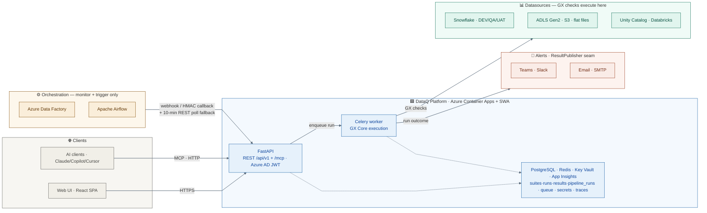

# DataQ — System Architecture

> Keep this diagram in sync with the code. When a new component, datasource, or integration is added, update the diagram in the same PR.

The flow reads left → right: **inputs** (Clients, Orchestration) drive the **DataQ platform** in the centre, which acts on its **targets** on the right (runs GX checks against datasources, publishes outcomes to alert channels).

## Legend

| Colour | Group |
|---|---|
| Grey | Clients — browser web UI + AI clients (over MCP) |
| Orange | Orchestration — ADF · Airflow (monitor + trigger only, **never** datasources) |
| Blue | DataQ platform — FastAPI · Celery worker · PostgreSQL · Redis · Key Vault · App Insights |
| Green | Datasources — GX checks run against these |
| Red | Alert channels — Teams · Slack · Email (the `ResultPublisher` seam) |

## Key invariants

- **Orchestration providers (ADF · Airflow) are not datasources.** They live in `pipeline_runs`, not `runs`. Trigger bindings map `(provider, pipeline_id, env) → suite_id`.
- **Scheduled/triggered suite runs are Celery-only.** FastAPI never enqueues GX itself for a full suite run; it dispatches a task. **Exception — synchronous preview paths:** the check dry-run (`POST /suites/{id}/checks/dryrun`) and the column profiler (`POST /suites/{id}/profile`) run a single GX check / a profiling query against the datasource **synchronously in a threadpool** (persisting nothing) — interactive authoring aids, not scheduled runs.
- **All connection secrets via Key Vault in production / staging.** Local dev may resolve secrets via `KV_SECRET_*` env vars through the `EnvSecretStore` backend (see [ADR 0009](adr/0009-flat-monorepo-layout.md) layout note and `backend/app/core/secrets.py`). No credentials are ever hardcoded.
- **The `/mcp` endpoint exposes the same service layer to AI clients.** The 8 FastMCP tools are thin wrappers reusing the same services + per-suite authz + sample redaction as the REST API — no logic duplication. Validated with the same Azure AD bearer token (a `JWTVerifier` on the same tenant/audience/scope), and **fail-closed** (not mounted without resolvable auth). See [ADR 0008](adr/0008-mcp-server.md).
- **Interactive API docs are off in production.** `/docs`, `/redoc`, and `/openapi.json` are disabled when `ENVIRONMENT=prod` (the prod-docs gate); available in dev/staging.
