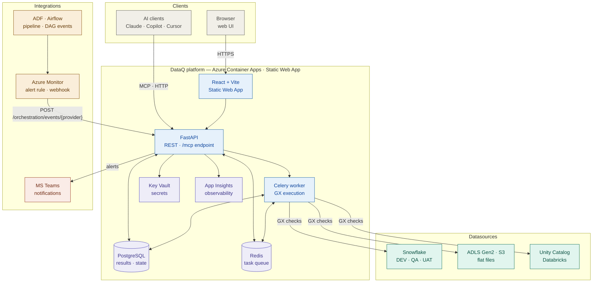

# DataQ — System Architecture

> Keep this diagram in sync with the code. When a new component, datasource, or integration is added, update the diagram in the same PR.

## Legend

| Colour | Group |
|---|---|
| Blue | DataQ services (React, FastAPI, Celery) |
| Purple | Azure platform infrastructure (PostgreSQL, Redis, Key Vault, App Insights) |
| Green | Datasources — GX checks run against these |
| Orange | Orchestration integrations — monitor + trigger only, never datasources |
| Brown/red | Notification channel |

## Key invariants

- **Orchestration providers (ADF · Airflow) are not datasources.** They live in `pipeline_runs`, not `runs`. Trigger bindings map `(provider, pipeline_id, env) → suite_id`.
- **Scheduled/triggered suite runs are Celery-only.** FastAPI never enqueues GX itself for a full suite run; it dispatches a task. **Exception — synchronous preview paths:** the check dry-run (`POST /suites/{id}/checks/dryrun`) and the column profiler (`POST /suites/{id}/profile`) run a single GX check / a profiling query against the datasource **synchronously in a threadpool** (persisting nothing) — interactive authoring aids, not scheduled runs.
- **All connection secrets via Key Vault in production / staging.** Local dev may resolve secrets via `KV_SECRET_*` env vars through the `EnvSecretStore` backend (see [ADR 0009](adr/0009-flat-monorepo-layout.md) layout note and `backend/app/core/secrets.py`). No credentials are ever hardcoded.
