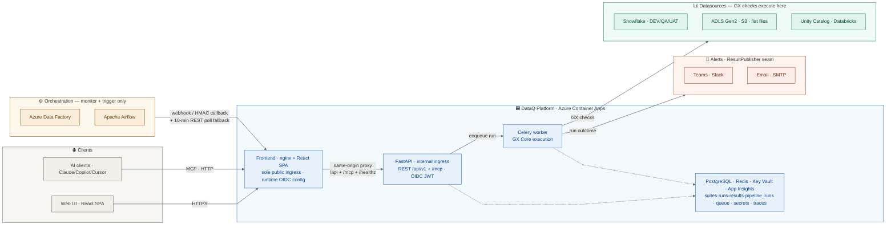
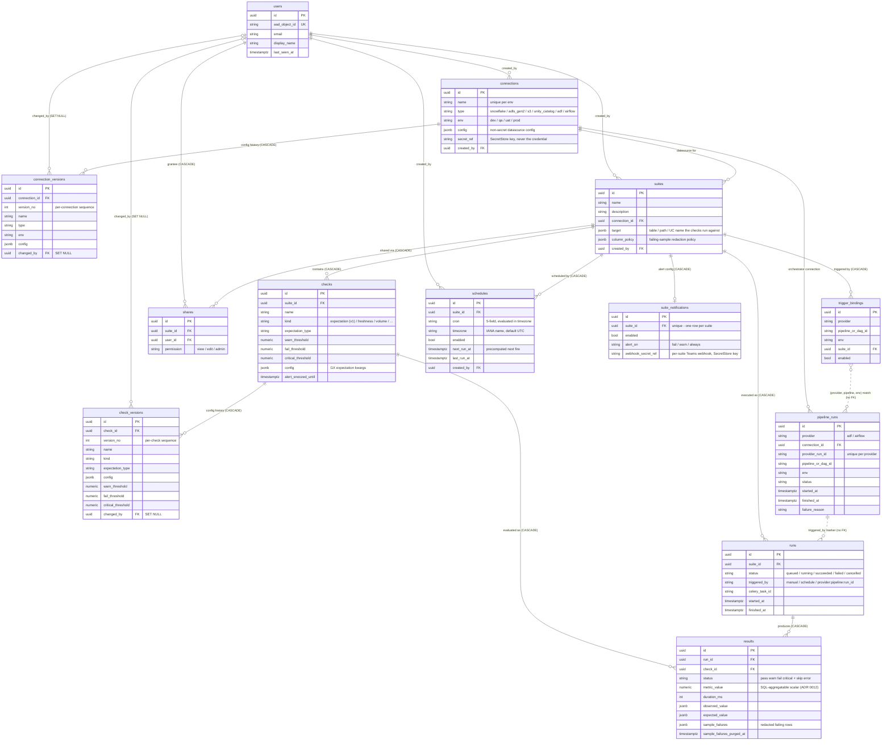
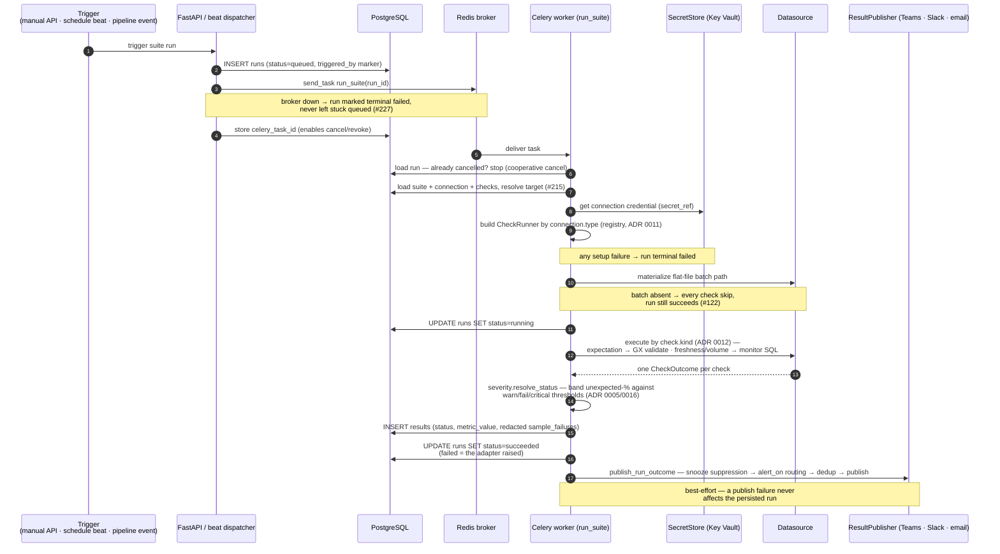
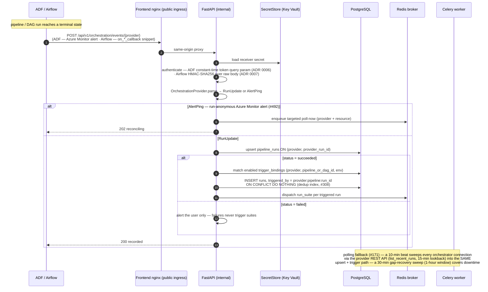
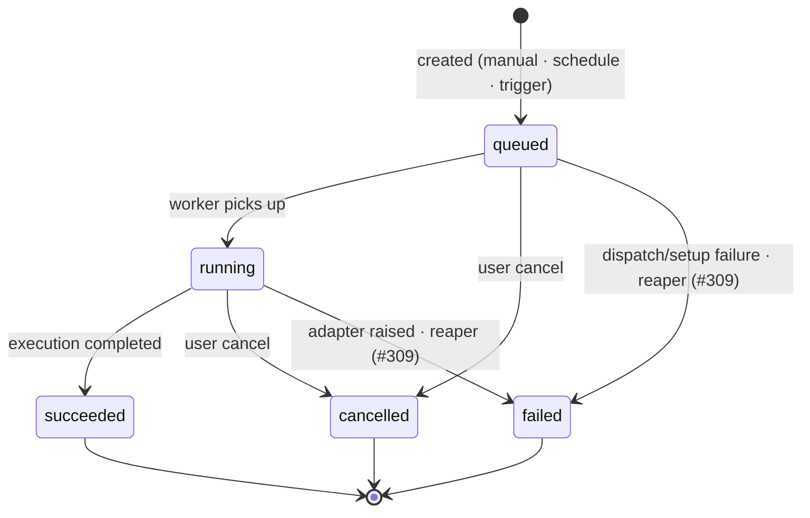
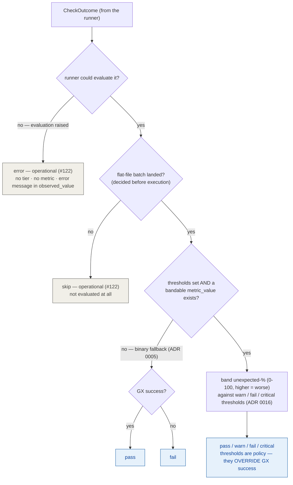
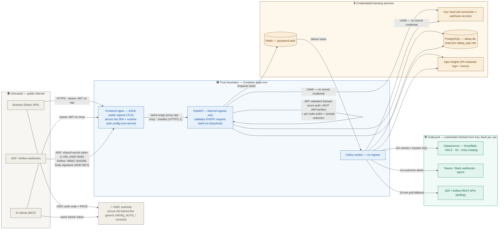

# DataQ — System Architecture

> Keep these diagrams in sync with the code. When a new component, datasource, integration, or DB table is added, update the relevant diagram in the same PR.
>
> ⚠️ **Mermaid gotcha — syntactically *valid* ≠ *renders correctly*.** In **sequence-diagram** text, `#` starts Mermaid's HTML-entity escape (`#35;` → `#`) and a stray `;` terminates a statement — a bare `#NNN` issue ref or an inline semicolon silently truncates the rendered line while the syntax check still passes. Write issue refs in sequence diagrams as `#35;NNN` (renders as `#NNN`; flowcharts/state/ER diagrams don't need this) and eyeball the rendered diagram before merging, not just the linter.

The flow reads left → right: **inputs** (Clients, Orchestration) drive the **DataQ platform** in the centre, which acts on its **targets** on the right (runs GX checks against datasources, publishes outcomes to alert channels).

## Legend

| Colour | Group |
|---|---|
| Grey | Clients — browser web UI + AI clients (over MCP) |
| Orange | Orchestration — ADF · Airflow (monitor + trigger only, **never** datasources) |
| Blue | DataQ platform — Frontend (nginx SPA) · FastAPI · Celery worker · PostgreSQL · Redis · Key Vault · App Insights |
| Green | Datasources — GX checks run against these |
| Red | Alert channels — Teams · Slack · Email (the `ResultPublisher` seam) |

## Data model (ER diagram)

> Source of truth: [`backend/app/db/models.py`](https://github.com/TheurgicDuke771/DataQ/blob/main/backend/app/db/models.py) (13 tables). Update this diagram in the same PR as any model/migration change.

### Reading notes

- **Conventions (elided from the diagram for noise):** every table has a `gen_random_uuid()` UUID PK and `created_at`; mutable entities also carry `updated_at`. Status/type columns are `TEXT` + `CHECK` constraints, **not** native PG enums (migration ergonomics).
- **Cascade posture (ADR [0020](adr/0020-history-and-audit-strategy.md)):** deleting a suite cascades its checks, runs, results, shares, trigger bindings, schedules, and notification config; deleting a connection cascades its version history. History is not retained past entity deletion — accepted. Version snapshots survive their *author* (`changed_by` is `SET NULL`), not their entity.
- **`pipeline_runs` ≠ `runs` — no FK between them.** Orchestrator pipeline executions correlate to the DQ suite runs they trigger only via the string marker `runs.triggered_by = '<provider>:<pipeline_or_dag_id>:<provider_run_id>'` (dotted lines above); `trigger_bindings` matches pipeline runs by `(provider, pipeline_or_dag_id, env)`, also without an FK. A partial unique index on `runs (suite_id, triggered_by)` dedupes orchestration-triggered runs.
- **Singleton constraints:** at most one orchestrator connection per `(type, env)` (partial unique index over `adf`/`airflow` only — datasources may repeat); one `suite_notifications` row per suite; one live `shares` row per `(suite, user)`.
- **Secrets are never in these tables.** `connections.secret_ref` / `suite_notifications.webhook_secret_ref` hold SecretStore *keys*; version snapshots deliberately omit credentials, so a credential rotation records no version.

## Runtime flows

The diagrams above show *structure* (who talks to whom, what is stored); these two show *ordering* for the flows that cross the most components.

### Suite run lifecycle

Every run — manual (`POST /suites/{id}/run`), scheduled (the 60s beat dispatcher), or orchestration-triggered — converges on the same path once the `Run` row exists:

Key sources: [`worker/tasks.py`](https://github.com/TheurgicDuke771/DataQ/blob/main/backend/app/worker/tasks.py) (`run_suite`), [`services/run_service.py`](https://github.com/TheurgicDuke771/DataQ/blob/main/backend/app/services/run_service.py) (`execute_run`), [`services/run_dispatch.py`](https://github.com/TheurgicDuke771/DataQ/blob/main/backend/app/services/run_dispatch.py), [`services/severity.py`](https://github.com/TheurgicDuke771/DataQ/blob/main/backend/app/services/severity.py), [`alerting/dispatch.py`](https://github.com/TheurgicDuke771/DataQ/blob/main/backend/app/alerting/dispatch.py).

### Orchestration event flow

How an ADF / Airflow pipeline outcome becomes (at most) a triggered suite run. Everything goes through the `OrchestrationProvider` seam (ADR [0004](adr/0004-orchestration-abstraction.md)) — no provider branching:

Key sources: [`api/v1/orchestration.py`](https://github.com/TheurgicDuke771/DataQ/blob/main/backend/app/api/v1/orchestration.py), [`services/orchestration_service.py`](https://github.com/TheurgicDuke771/DataQ/blob/main/backend/app/services/orchestration_service.py), [`worker/tasks.py`](https://github.com/TheurgicDuke771/DataQ/blob/main/backend/app/worker/tasks.py) (`poll_orchestration_runs`, `recover_orchestration_gaps`).

## Status semantics

### Run lifecycle

`runs.status` describes **execution, not data quality** — a run whose checks all failed is still `succeeded`.

- **`succeeded` means executed** — checks may still have failed; the data-quality outcome lives in `results.status`.
- **Cancel works on any non-terminal run:** the API sets `cancelled` and best-effort revokes the Celery task; the worker also honours the status cooperatively (start-check before executing).
- **The reaper (#309)** drives runs orphaned in `queued`/`running` past a threshold (task never published, or the worker died mid-run) to terminal `failed`.

### Result status derivation

`results.status` has two orthogonal families: the four **severity tiers** (ADR [0005](adr/0005-severity-tier-weights.md)) and the two **operational statuses** (#122). Only the tiers carry health-score weight (0.5 / 1.0 / 2.0 for warn / fail / critical); `skip`/`error` **must be excluded from the health-score denominator**.

The single decision lives in [`services/severity.py`](https://github.com/TheurgicDuke771/DataQ/blob/main/backend/app/services/severity.py) (`resolve_status`), shared by run persistence and the check-editor dry-run so a preview can never disagree with the run it previews.

## Trust boundaries & authentication

The one-diagram consolidation of ADRs [0006](adr/0006-adf-webhook-authentication.md) / [0007](adr/0007-airflow-callback-model.md) / [0008](adr/0008-mcp-server.md) / [0028](adr/0028-cloud-neutral-image-runtime-config-generic-oidc.md) — what crosses each boundary and what credential it carries:

Boundary notes:

- **Defense in depth, not perimeter trust:** the API validates every request's bearer JWT itself (`fastapi-azure-auth` for REST, `JWTVerifier` for MCP — same tenant/audience/scope) even though it is only reachable through the frontend proxy. Platform-level auth (SWA EasyAuth) is explicitly disabled (#511).
- **The only endpoints that bypass user JWT auth** are the two orchestration webhook receivers (each with its own secret scheme, above) and the health probe. Webhook secrets live in Key Vault and are compared constant-time; they are never logged.
- **Nothing secret is baked into images or served to the browser.** The frontend's runtime `DATAQ_AUTH_*` config is non-secret OIDC metadata (ADR 0028); all real secrets resolve at use-time from Key Vault via user-assigned managed identity.
- **MCP is fail-closed:** without resolvable auth config the `/mcp` mount does not come up at all (ADR 0008).

## Key invariants

- **The frontend Container App is the sole public surface** (ADR [0028](adr/0028-cloud-neutral-image-runtime-config-generic-oidc.md) §5). It's one generic nginx image whose auth is injected at **runtime** (`DATAQ_AUTH_*` → generic OIDC, validated against Azure AD — no MSAL, nothing cloud-specific baked in), and it reverse-proxies `/api` + `/mcp` + `/healthz` same-origin to the **internal-ingress** API. The API is not reachable directly from the internet; external orchestrator webhooks land on the frontend and are proxied through.
- **Orchestration providers (ADF · Airflow) are not datasources.** They live in `pipeline_runs`, not `runs`. Trigger bindings map `(provider, pipeline_id, env) → suite_id`.
- **Scheduled/triggered suite runs are Celery-only.** FastAPI never enqueues GX itself for a full suite run; it dispatches a task. **Exception — synchronous preview paths:** the check dry-run (`POST /suites/{id}/checks/dryrun`) and the column profiler (`POST /suites/{id}/profile`) run a single GX check / a profiling query against the datasource **synchronously in a threadpool** (persisting nothing) — interactive authoring aids, not scheduled runs.
- **All connection secrets via Key Vault in production / staging.** Local dev may resolve secrets via `KV_SECRET_*` env vars through the `EnvSecretStore` backend (see [ADR 0009](adr/0009-flat-monorepo-layout.md) layout note and `backend/app/core/secrets.py`). No credentials are ever hardcoded.
- **The `/mcp` endpoint exposes the same service layer to AI clients.** The 8 FastMCP tools are thin wrappers reusing the same services + per-suite authz + sample redaction as the REST API — no logic duplication. Validated with the same Azure AD bearer token (a `JWTVerifier` on the same tenant/audience/scope), and **fail-closed** (not mounted without resolvable auth). See [ADR 0008](adr/0008-mcp-server.md).
- **Interactive API docs are off in production.** `/docs`, `/redoc`, and `/openapi.json` are disabled when `ENVIRONMENT=prod` (the prod-docs gate); available in dev/staging.
