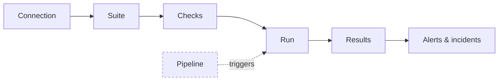

# Concepts

Six words carry the whole product. Here they are, in the order you meet them.

| Word | Plain English | Where you see it |
|---|---|---|
| **Connection** | How DataQ reaches one datasource (or one orchestrator), with its credential kept in the secret store | Connections |
| **Suite** | A named set of checks against one target table or file | Suites |
| **Check** | One rule: a value expectation, a monitor (freshness, volume, schema drift, anomaly), a comparison, or custom SQL | Suite → Checks |
| **Run** | One execution of a suite: manual, scheduled, or triggered by a pipeline | Results |
| **Result** | What each check found: pass · warn · fail · critical, plus the number it measured | Run detail |
| **Incident** | A critical breach anchored to the asset it hit, with evidence, until someone resolves it | Dashboard, Assets |

## The one distinction: datasource vs orchestration

- **Datasources** are stores you write data-quality checks *against*: **Snowflake**,
  **ADLS Gen2**, **AWS S3** (or any S3-compatible store — MinIO, Ceph, R2, Wasabi, Backblaze),
  **Unity Catalog (Databricks)**, **Apache Iceberg** (native read).
- **Orchestration providers** are workflow engines DataQ *observes* — **Azure Data
  Factory (ADF)**, **Apache Airflow**, and **dbt**. DataQ does three things with them: monitor
  pipeline/DAG/build runs, detect failures in near-real-time, and **trigger a check suite when a
  pipeline finishes successfully**. They are **not** datasources — you never write checks
  against ADF/Airflow/dbt.

!!! note
    This split is load-bearing throughout the product. Orchestration runs live in
    `pipeline_runs`; data-quality runs live in `runs`. They're linked, never conflated.

## Core objects

{ .screenshot }

- **Connection** — credentials + config for one datasource or orchestration provider.
- **Suite** — a named collection of checks that runs against one connection's target
  (a table, a file/path, a Unity Catalog table, or an Iceberg `namespace.table`).
- **Check** — a single data-quality rule. Six kinds: a **Great Expectations expectation**
  (e.g. "this column is never null", or a custom SQL rule), or one of the monitor kinds —
  **freshness** (is the data stale?), **volume** (did the load land whole?),
  **schema drift** (did the shape change?), **anomaly** (is this value abnormal for this
  dataset?), and **comparison** (does it reconcile against a baseline dataset?).
- **Run** — one execution of a suite. Each check produces a **result** with a status:
  **pass / warn / fail / critical** (plus *skip* / *error* for operational outcomes).
- **Severity & health score** — warn/fail/critical are weighted into a workspace **health
  score** and trend so you can see quality moving over time.

## How a check runs

You author a suite → run it manually, on a **schedule**, or **triggered** by a pipeline →
a Celery worker executes the checks via Great Expectations against the datasource →
results are stored, the health score updates, and alerts fire (Teams / Slack / email) for
failures. See **[Architecture](../architecture/overview.md)** for the flow.
